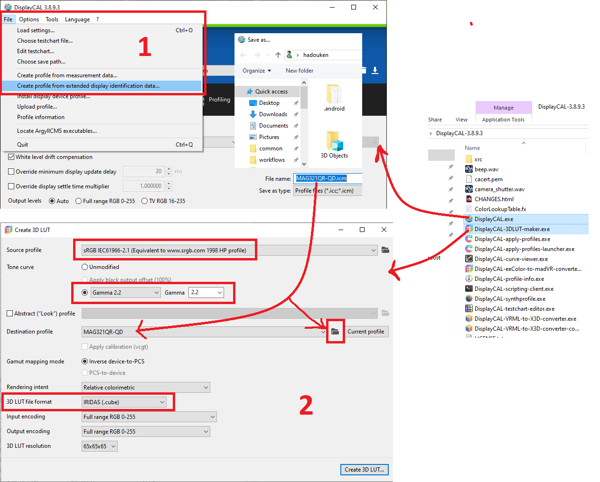

# A fork of the [laurex dwm_lut](https://github.com/lauralex/dwm_lut)
## [Download latest release](https://github.com/hadoooooouken/dwm_lut_fps_boost/releases/download/1.0.2/dwm_lut_fps_boost_1.0.2.zip)

## Dependencies
- Visual C++ runtime (https://www.techpowerup.com/download/visual-c-redistributable-runtime-package-all-in-one/)

# Comparison

| Cyberpunk 2077 | No dwm_lut | Old dwm_lut | Optimized dwm_lut | Boost |
| :--- | :---: | :---: | :---: | :---: |
| **Average fps** | 90 | 78 | 87 | **+11.5%** |
| **Min fps** | 77 | 68 | 75 | **+10.3%** |
| **Max fps** | 104 | 89 | 100 | **+12.4%** |
| **Frames** | 5832 | 5046 | 5590 | **+10.8%** |

# About
Tested only with Windows 10 in SDR mode

# Usage
Use DisplayCAL or similar to generate .cube LUT files of any size, run `DwmLutGUI.exe`, assign them to monitors and then click Apply. Note that LUTs cannot be applied to monitors that are in "Duplicate" mode.

For ColourSpace users with HT license level, 65^3 eeColor LUT .txt files are also supported.

HDR LUTs must use BT.2020 + SMPTE ST 2084 values as input and output.

Minimizing the GUI will make it disappear from the taskbar, and you can use the context menu of the tray icon to quickly apply or disable all LUTs. For automation, you can start the exe with any (sensible) combination of `-apply`,  `-disable`, `-minimize` and `-exit` as arguments.

Note: DirectFlip and MPO get force disabled on monitors with an active LUT. These features are designed to improve performance for some windowed applications by allowing them to bypass DWM (and therefore also the LUT). This ensures that LUTs get applied properly to all applications (except exclusive fullscreen ones).

# How to generate a profile without a calibrator?
Download and unpack DisplayCAL ZIP version - https://displaycal.net/#download

https://displaycal.net/download/standalone/DisplayCAL-win32.zip

# Compiling
Install [vcpkg](https://vcpkg.io/en/getting-started.html) for C++ dependency management:

- Create and switch to your desired install folder (e.g. _%LOCALAPPDATA%\vcpkg_)
- `git clone https://github.com/Microsoft/vcpkg.git .`
- `.\bootstrap-vcpkg.bat`
- `vcpkg integrate install`

Just open the projects in Visual Studio and compile a x64 Release build.
